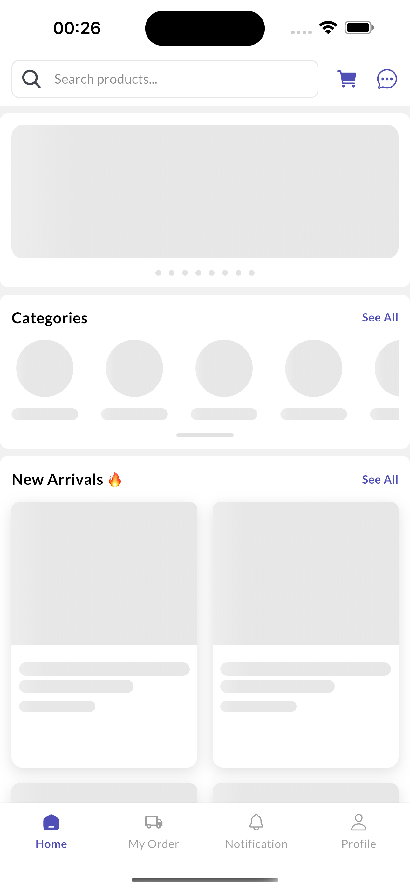
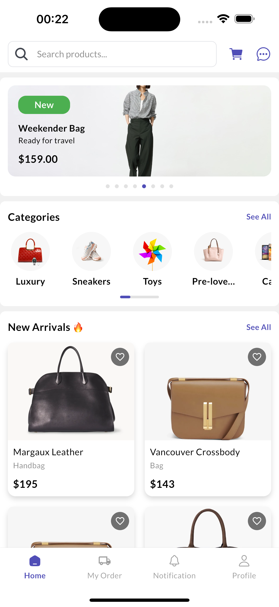
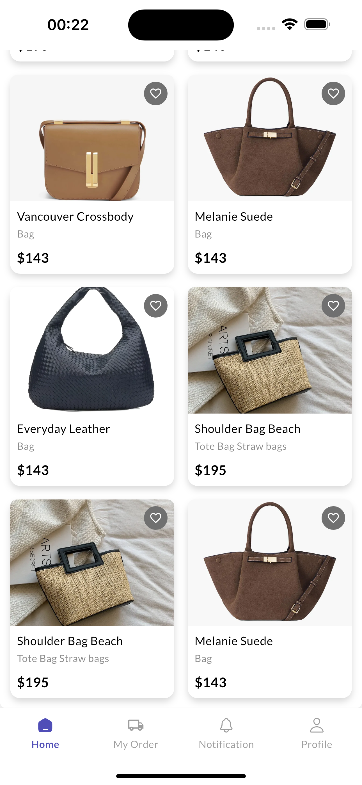
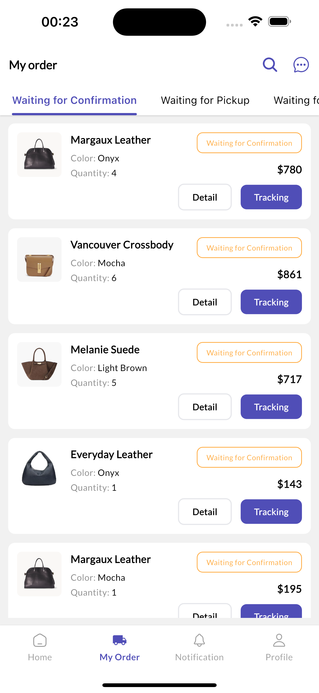
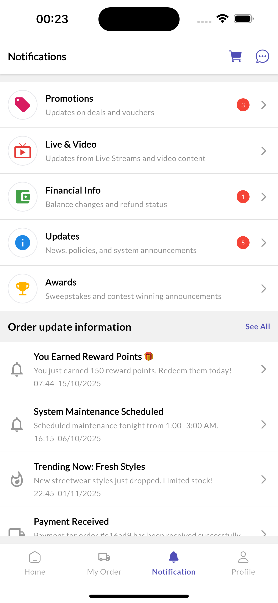
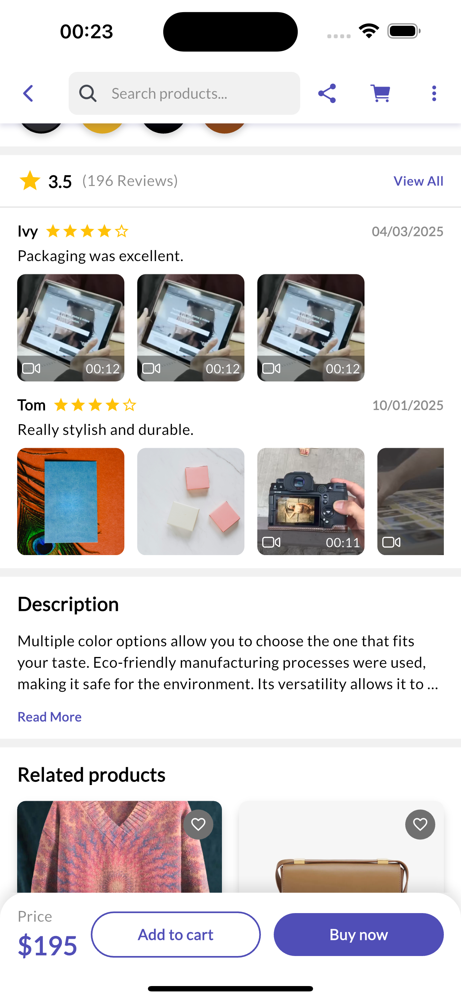
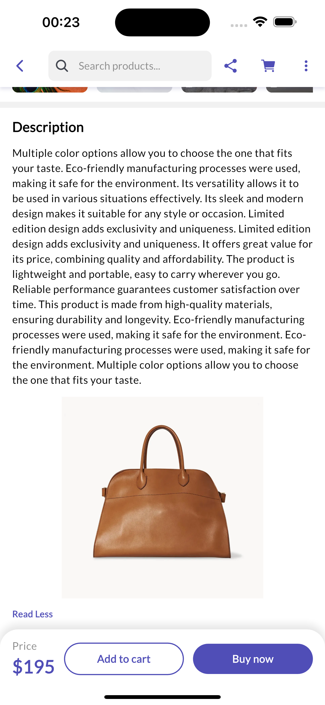

# dutuku_e_commerce

## Figma inspired

- inspired by:
  https://www.figma.com/design/MWXnUlavawxNQSMaYIsRRh/Kutuku----eCommerce-Mobile-App-UI-Kit-Figma-High-Quality-Template--Community-?node-id=0-1&p=f

## Tech Stack

- Flutter
- Firebase
- Fastlane
- Clean Architecture
- Bloc for state management

## Version

- Flutter: 3.32.1
- Dart: 3.8.1
- Android Studio: 2024.3
- Java: 21.0.7
- Xcode: 16.3
- CocoaPods: 1.16.2

## DB Design

- https://drive.google.com/file/d/1vY04Wm6R2z69D4JhJ8cdIqszU7TTXFpA/view?usp=sharing

## Screenshots

<!-- Screenshots Table -->
<table>
  <tr>
    <td></td>
    <td></td>
  </tr>
  <tr>
    <td></td>
    <td></td>
  </tr>
  <tr>
    <td></td>
    <td></td>
  </tr>
  <tr>
    <td></td>
    <td></td>
  </tr>
  <tr>
    <td></td>
    <td></td>
  </tr>
</table>

## Command

```
flutter pub run build_runner build --delete-conflicting-outputs
```

```
flutter gen-l10n
```
