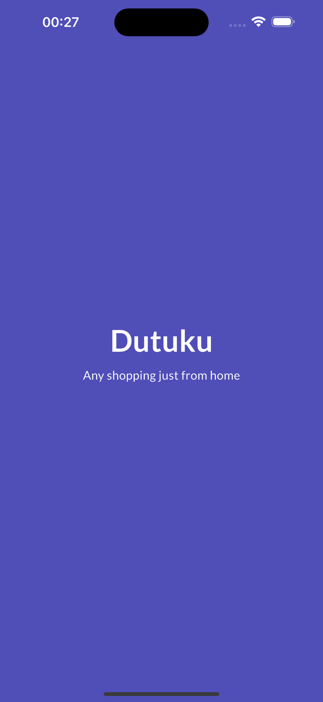
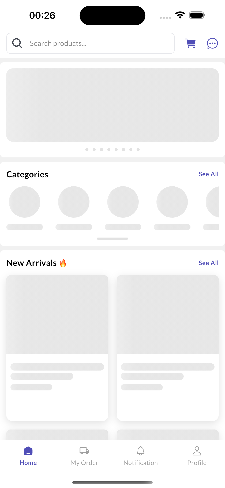
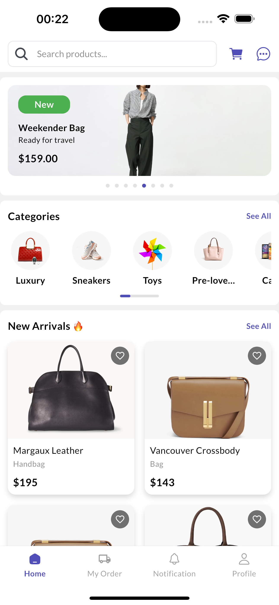
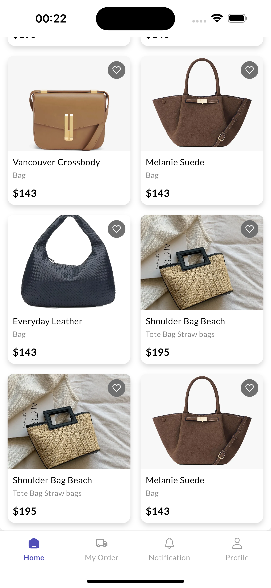
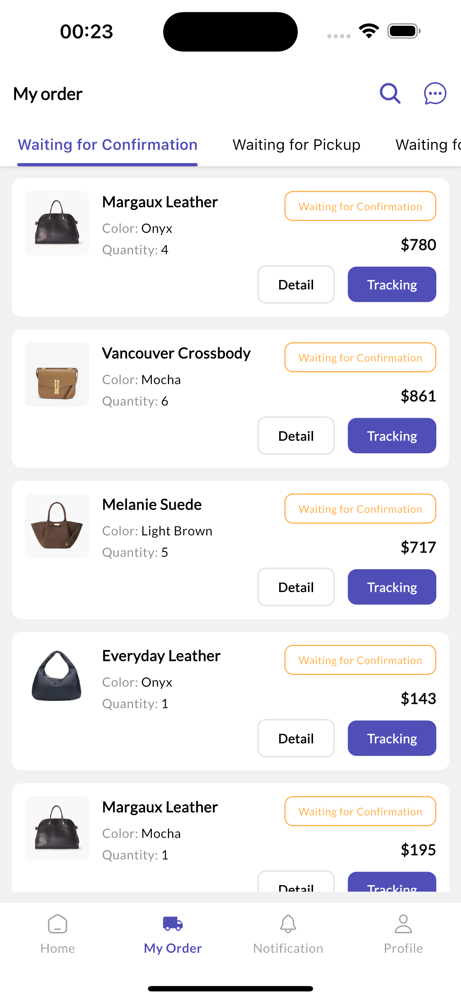
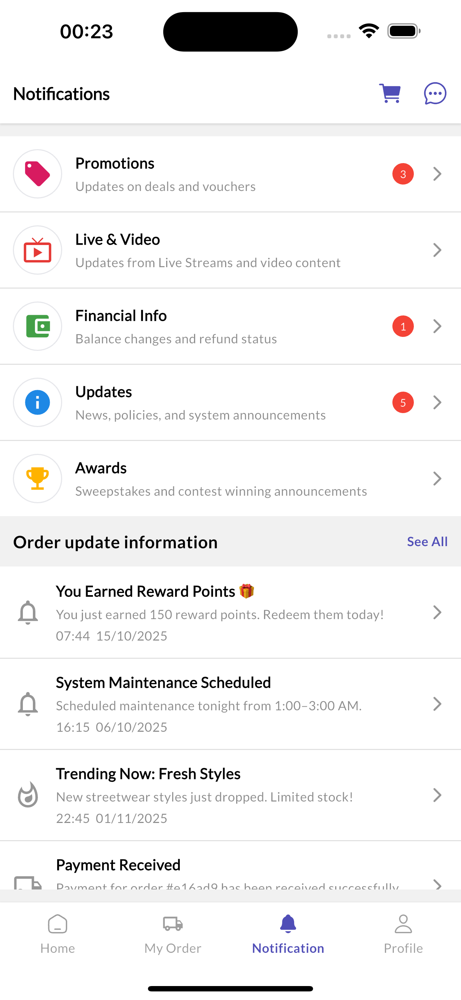
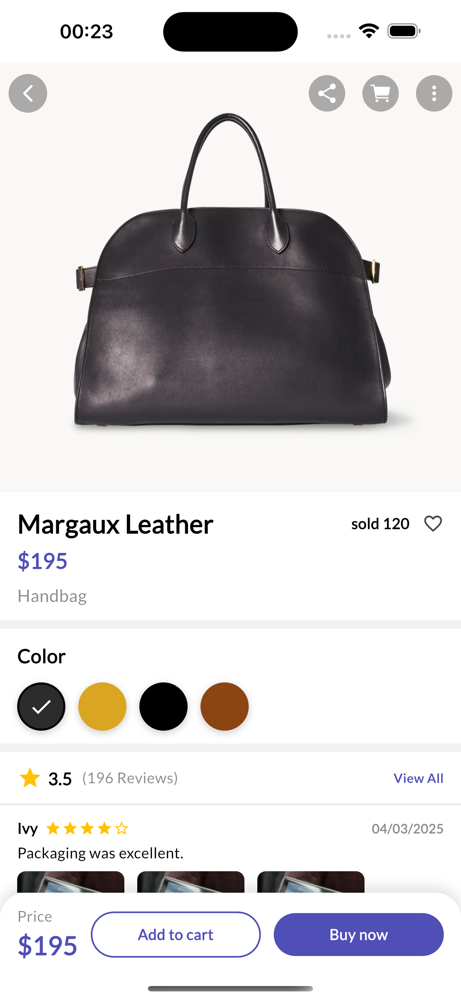
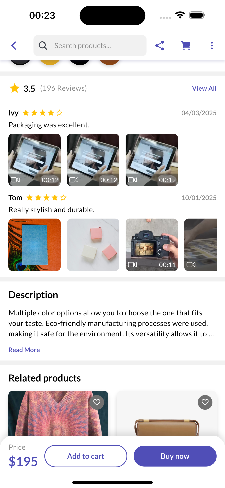
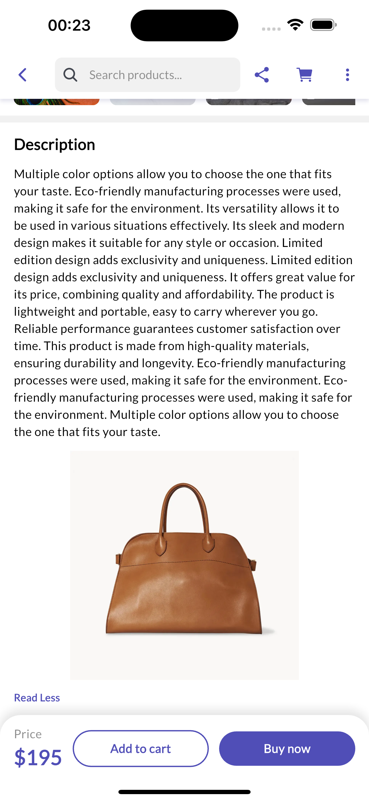

# dutuku_e_commerce

A Flutter e-commerce app, UI inspired by the [Kutuku Figma template](https://www.figma.com/design/MWXnUlavawxNQSMaYIsRRh/Kutuku----eCommerce-Mobile-App-UI-Kit-Figma-High-Quality-Template--Community-?node-id=0-1&p=f).

## Tech Stack

- Flutter · Fastlane · Firebase App Distribution (CD only — in-app Firebase is temporarily disabled)
- Feature-based Clean Architecture
- Bloc/Cubit for state management
- Melos workspace (app + `packages/*`)

## Getting Started

The project depends on [`system_design_flutter`](https://github.com/DAMHONGDUC/system_design_flutter) as a **git submodule** at `packages/system_design_flutter` (a `pubspec.yaml` path dependency — `pub get` fails if it's not checked out), and pins the Flutter version via [FVM](https://fvm.app) (`.fvmrc`).

```bash
# 1. Clone (submodules included)
git clone --recurse-submodules https://github.com/DAMHONGDUC/dutuku_e_commerce_3.git

# 2. Flutter version (FVM)
fvm install && fvm use 3.38.8

# 3. One-shot setup — submodules + deep clean + pub get everywhere + all codegen
fvm dart run melos run setup

# 4. Run
fvm flutter run
```

> Cloned without `--recurse-submodules`? Run `git submodule update --init --recursive` first — `pub get` can't resolve the `system_design_flutter` path dependency until the submodule is checked out.

**Working on the design system?** `setup` leaves the submodule on the latest `main` branch, so you can edit `packages/system_design_flutter` directly: commit & push there, then commit the updated pointer here (`git add packages/system_design_flutter`). If the pointer moved, remember to commit it so CI and other clones pick up the same design-system commit.

## Melos workspace

The repo is a [Melos](https://melos.invertase.dev) workspace containing the app (root) and every package under `packages/` (including the `system_design_flutter` submodule). Scripts are defined in `melos.yaml` and run across all packages at once:

| Script | What it does |
| --- | --- |
| `melos run setup` | **one-shot setup**: submodule checkout (always on latest `main`) + deep clean + bootstrap + all codegen — run after cloning, and again after any `git pull` |
| `melos bootstrap` | `pub get` in every package |
| `melos run analyze` | `flutter analyze` in every package |
| `melos run test` | `flutter test` in every package that has `test/` |
| `melos run format` / `format:check` | format all packages / fail on unformatted code |
| `melos run gen:l10n` | generate localizations (app only) |
| `melos run gen:build` | `build_runner` in packages that depend on it |
| `melos run gen:all` | all code generation in one go |
| `melos run clean:flutter` | `flutter clean` in every package |
| `melos run clean:deep` | `clean:flutter` + remove iOS `Pods/` and `Podfile.lock` (regenerated by the next pod install / build) |

Prefix with `fvm dart run` (e.g. `fvm dart run melos run test`) — melos is a dev dependency, no global install needed. Note: versioning/publishing features of melos are intentionally not used, since `system_design_flutter` lives in its own repo (submodule) and is versioned by its commit pointer.

To bump the design-system submodule intentionally: `git submodule update --remote packages/system_design_flutter`, verify the app still builds, then commit the new pointer (`git add packages/system_design_flutter`).

## Version

- Flutter: 3.38.8 (pinned in `.fvmrc`)
- Dart: 3.10.7
- Android Studio: 2024.3
- Java: 17.0.12 LTS
- Xcode: 26.4
- CocoaPods: 1.16.2


## DB Design

- https://drive.google.com/file/d/1vY04Wm6R2z69D4JhJ8cdIqszU7TTXFpA/view?usp=sharing

## Screenshots

<!-- Screenshots Table -->
<table>
  <tr>
    <td></td>
    <td></td>
  </tr>
  <tr>
    <td></td>
    <td></td>
  </tr>
  <tr>
    <td></td>
    <td></td>
  </tr>
  <tr>
    <td></td>
    <td></td>
  </tr>
  <tr>
    <td></td>
    <td></td>
  </tr>
</table>


## Architecture

**Feature-based Clean Architecture**: each feature owns its own `domain`/`data`/`presentation` slice under `lib/src/features/<feature>/`; `core` holds cross-cutting building blocks; `di/injector.dart` only calls each feature's `<Feature>Di.config()`.

```
lib/src
├── features
│   ├── product/       # product detail, search, recommended products — the biggest feature
│   ├── order/         # my orders + order detail
│   ├── banner/  category/  notification/  profile/
│   ├── home/          # presentation-only: composes banner/category/product sections
│   └── splash/  tutorial/  login/  register/  bottom_tab/  preview_media/
├── core               # constants, enums, l10n, resources, exceptions, shared widgets/utils
└── di/injector.dart
```

Inside a feature:

```
features/<feature>/
├── domain/            # entities, repository contract, usecases + domain.dart barrel
├── data/              # models (DTOs), mappers, mock, data sources, repository impl
└── presentation/      # screens, Cubit controllers/states, feature-local widgets
```

**Dependency rule** — dependencies always point inward; a feature only exposes its `domain/domain.dart` barrel:

```
presentation → domain ← data          (inside one feature)
featureA.domain → featureB.domain     (only for truly shared business concepts)
```

**Data flow**: UI → Cubit controller → usecase → repository interface → repository impl → data source (mock) — then `Either<Failure, Entity>` flows back up and the controller emits a new state.

Every feature's `data/mock/*` stands in for a real API. Since `domain` only depends on interfaces, swapping mock for a real API only touches that feature's `data` layer.

## Testing

Test structure mirrors `lib/src/features/`: usecase tests, repository-impl tests, and `bloc_test` coverage per Cubit (loading/loaded/error state sequences). Mocking uses [`mocktail`](https://pub.dev/packages/mocktail) with shared fakes in `test/helpers/` — no code generation needed.

```
fvm dart run melos run test
```

## CI/CD

Two GitHub Actions workflows under `.github/workflows/`:

- **`ci.yml`** — on every push/PR to `main`: `melos bootstrap` then `melos run analyze` + `melos run test` across all workspace packages. No secrets needed.
- **`deploy.yml`** — manual (`workflow_dispatch`) release pipeline: restores the gitignored signing/config files from repo secrets, then runs Fastlane to build and upload to **Firebase App Distribution**. `deploy-android` is fully wired; `deploy-ios` is gated behind the `IOS_DEPLOY_ENABLED` repo variable until Apple signing secrets are configured.

> Note: in-app Firebase integration (`firebase_core`) is **temporarily disabled** — the app runs fully on mock data and needs no Firebase config to build. Firebase App Distribution above is only the delivery channel for release builds.

### Required secrets

| Secret | Used by | Description |
| --- | --- | --- |
| `ANDROID_KEYSTORE_BASE64` | Android | `base64 android/app/dutuku-upload-keystore.jks` |
| `ANDROID_KEYSTORE_PASSWORD` | Android | `storePassword` from `android/key.properties` |
| `ANDROID_KEY_PASSWORD` | Android | `keyPassword` from `android/key.properties` |
| `ANDROID_KEY_ALIAS` | Android | `keyAlias` from `android/key.properties` |
| `ANDROID_GOOGLE_SERVICES_JSON_BASE64` | Android | `base64 android/app/google-services.json` |
| `IOS_GOOGLE_SERVICE_INFO_PLIST_BASE64` | iOS | `base64 ios/Runner/GoogleService-Info.plist` |
| `FIREBASE_SERVICE_ACCOUNT_JSON_BASE64` | both | base64 of a Firebase service account JSON ("Firebase App Distribution Admin" role) |
| `ENV_DART_DEFINE_JSON_BASE64` | both, optional | `base64 env/dev.json`, passed to `flutter build` as `--dart-define-from-file` |
| `APPLE_TEAM_ID` | iOS | Apple Developer Team ID |
| `APPLE_PROVISIONING_PROFILE_NAME` | iOS | Name of the ad-hoc provisioning profile |
| `APPLE_PROVISIONING_PROFILE_BASE64` | iOS | `base64` of the `.mobileprovision` file |
| `APPLE_CERTIFICATE_BASE64` | iOS | `base64` of the distribution certificate `.p12` |
| `APPLE_CERTIFICATE_PASSWORD` | iOS | Password for the `.p12` above |

Repo variables: `FIREBASE_DISTRIBUTION_GROUPS` (default `testers`) and `IOS_DEPLOY_ENABLED` (default `false`).